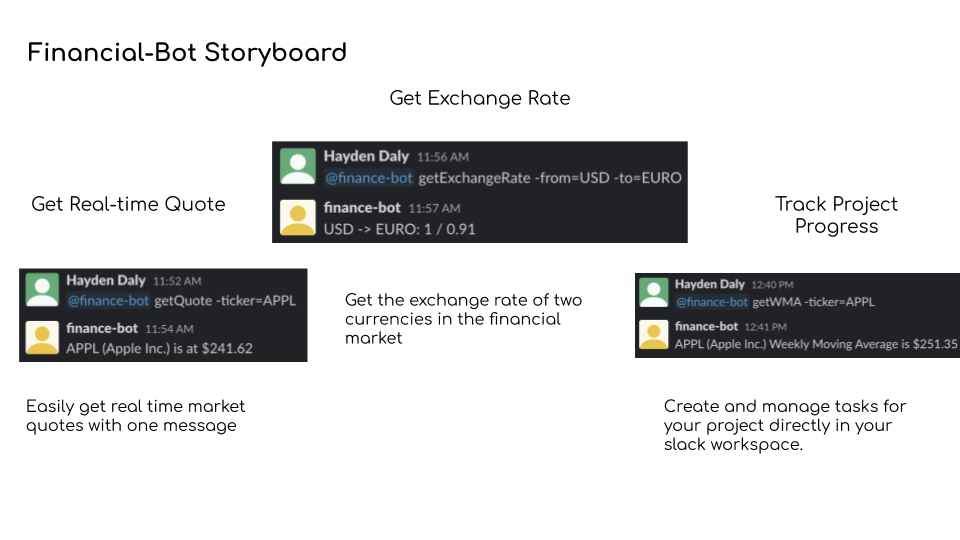

# Design Documentation

## Problem Statement

The problem we chose is that it is difficult to check TopCoder project status from the developers working environment. This is a problem because it reduces the developers efficiency to access the website for project details. Many developers dislike working out of their accustomed environments and see asking the website as a hassle.

## Bot Description

The bot allows for developers to access crucial project data in a timely manner directly from the Slack environment. This will allow for users to initialize a Slack channel or workspace based around a TopCoder project and be able to call on the bot for informational functions. This is a good solution to the stated problem because many developers use Slack channels to manage work and using this bot will allow them to share project information with their team directly rather than having to reiterate it saving a significant amount of time.

This will start off as a minimum viable prototype of a chatbot that will take in specific commands and parameters and return an output. If time permits, we want to first make this bot conversational using Natural Language Understanding. If time permits after that, we additionally want to integrate our bot with other tools like Trello to easily integrate the TopCoder tasks onto a Trello board. A tagline for this bot is “TopCoder management from the comfort of your Slack Workspace”.

## Use Cases

1. Get Open Tasks
  * **Preconditions**
    1. Bot is in the Slack channel.
  * **Main Flow**
    1. Users message requesting to get open tasks [S1]
    2. The bot responds with open tasks [S2]
    3. Users then can reply to messages for additional details [S3]
  * **Sub Flows**
    1. [S1]  User calls on bot by using “@top-coder-bot” followed by the command “getOpenTasks [projectID]”.
    2. [S2] The bot will list out the remaining open tasks and relevant information.
    3. [S3] Users can view task requirements by responding to the bot’s message with “@top-coder-bot” and then follow with “getTaskRequirements [taskID]”.
  * **Alternate Flows**
    1. [E1] The provided projectID does not exist.
    2. [E2] There exist no tasks.
    3. [E3] The provided taskID does not exist.
1. Get User Tasks Completed**
  * **Preconditions**
    1. Bot is in the Slack channel
  * **Main Flow**
    1. Users message requesting to the tasks a user has completed [S1]
    2. The bot responds with the tasks the user completed [S2]
    3. Users can reply to messages for additional details [S3]
  * **Sub Flows**
    1. [S1] User calls on the bot by using “@top-coder-bot” followed by the command “getUserTasksCompleted [projectID] [userID]
    2. [S2] The bot will list out the tasks that a given user has completed.
    3. [S3] The user can request for additional information by responding to the bot’s message with “@top-coder-bot” and then follow with “getTaskInfo [taskID]” which will respond with the info including requirements and the time completed.

## Design Sketches

Story Board:

Sequence Flow:

## Architecture Design

