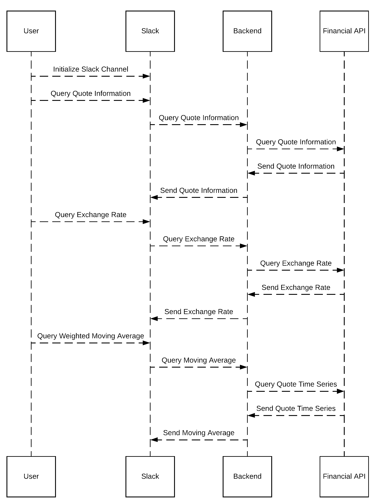

# Design Documentation

## Problem Statement

The problem we chose is that there exists no smooth integrations for financial trading and Slack. This is a problem because it reduces the traders efficiency because they have to use multiple dashboards separate from their group workspace. This is a hassle for traders when trading is dependent on split-second decisions.

## Bot Description

The bot allows for traders to access crucial financial data in a timely manner directly from the Slack environment. This will allow for users to initialize a Slack channel with the bot and be able to call on the bot for informational functions. This is a good solution to the stated problem because many traders use Slack channels to manage portfolios and using this bot will allow them to share financial information with their team directly rather than having to reiterate it saving a significant amount of time.

This will start off as a minimum viable prototype of a chatbot that will take in specific commands and parameters and return an output. If time permits, we want to first make this bot conversational using Natural Language Understanding. If additional time permits beyond that, we will make the bot take in actual trading commands and connect it to a portfolio with an API like Robinhood's.

## Use Cases

1. Get Quote of Ticker
  * **Preconditions**
    1. Bot is in the Slack channel.
  * **Main Flow**
    1. Users message requesting to get stock quote [S1]
    2. The bot responds with stock quote [S2]
  * **Sub Flows**
    1. [S1]  User calls on bot by using “@stock-bot” followed by the command “getQuote -ticker=[Ticker]”.
    2. [S2] The bot will respond information including bid, ask, and mid price.
  * **Alternate Flows**
    1. [E1] The provided [Ticker] does not exist.
    2. [E2] The user adds the flag '-data=[json or csv]' to get the quote in a non plain text format that can be used in data processing

2. Get Exchange Rate
  * **Preconditions**
    1. Bot is in the Slack channel
  * **Main Flow**
    1. Users message requesting exchange rate [S1]
    2. The bot responds with the exchange rate [S2]
  * **Sub Flows**
    1. [S1] User calls on the bot by using “@stock-bot” followed by the command “getExchange -from=[CURRENCY] -to=[CURRENCY]
    2. [S2] The bot will return the exchange rate.
  * **Alternate Flows**
    1. [E1] The provided currency codes don't exist and then will return a list of accepted currency symbols.
    2. [E2] The user adds the flag '-data=[json or csv]' to get the exchange rate in a non plain text format that can be used in data processing.

3. Get Weighted Moving Average
  * **Preconditions**
    1. Bot is in the Slack channel
  * **Main Flow**
    1. Uses message requesting WMA of Ticker [S1]
    2. The bot responds with the WMA [S2]
  * **Sub Flows**
    1. [S1] User calls on bot by using "@stock-bot" followed by the command "getWMA -ticker=[Ticker]"
    2. [S2] The bot will respond the weighted moving average for the specified period.
  * **Alternate Flows**
    1. [E1] The provided [Ticker] does not exist.
    2. [E2] The user adds the flag '-interval=[1min, 5min, 15min, 30min, 60min, daily, weekly, or monthly]' to get the WMA.
    3. [E3] The user adds the flag '-data=[json or csv]' to get the WMA in a non plain text format that can be used in data processing.

## Design Sketches

Story Board:

Sequence Flow:

## Architecture Design

