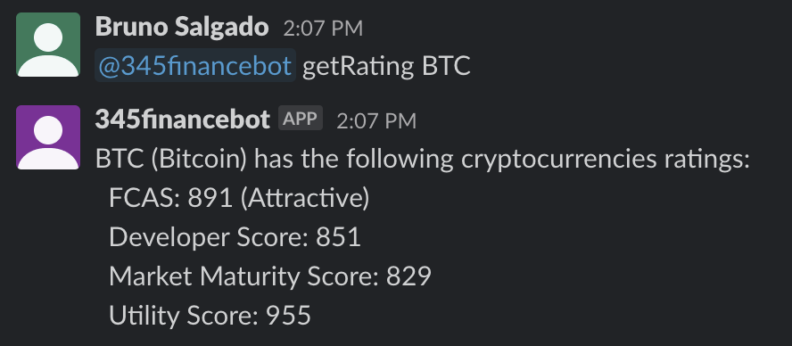

# Report
## Problem Statement

The problem we chose is that there exists no smooth integrations for financial trading and Slack. This is a problem because it reduces the traders efficiency because they have to use multiple dashboards separate from their group workspace. This is a hassle for traders when trading is dependent on split-second decisions.

## Primary Features

The bot allows for traders to access crucial financial data in a timely manner directly from the Slack environment. This allows for users to initialize a Slack channel with the bot and be able to call on the bot for informational functions. This is a good solution to the stated problem because many traders use Slack channels to manage portfolios and using this bot allows them to share financial information with their team directly rather than having to reiterate it saving a significant amount of time.

To meet the problem statement accordingly, we defined a list of necessary features required by the system based on insight from sources in the trader industry and personal experience. Many of these features have similar input/output format so we have attached screenshots of a select few of them in action to display the differentiation. The list of features is as follows:

Get the quote of a specified index.
Get exchange rate between two currencies.

**Figure 1: Exchange Rate Example**

Get the weighted moving average (WMA) of a specified index.
Search for more details regarding an index either by ticker or name.
Get the Bollinger Band (BBANDS) value of a specified index.
Get the commodity channel index (CCI) of a specified index.
Get the rating of a cryptocurrency (including multiple metrics).

**Figure 2: Crypto-Rating Example**

Get the exponential moving average (EMA) of a specified index.
Get the on balance volume (OBV) of a specified index.
Get the relative strength index (RSI) of a specified index.
Get the stochastic oscillator  (STOCH) of a specified index.
Get the moving average convergence divergence (MACD) of a specified index.

**Figure 3: MACD Example**

Get a list of all available commands.

**Figure 4: Help Example**

## Reflection on the Development Process and Project

We did not utilize Scrum to its full potential due to a general lack of experience using the methodology prior. To fix this, we would’ve clearly defined a timeline to ensure tasks are equally distributed overtime.
It was sometimes difficult to ensure uniform formatting and naming conventions. The project could have benefited from additional time spent outlining the conventions used throughout the project. In addition, there was some code that could have been largely improved by refactoring or implementing design patterns. Ideally, these would be implemented if some extra time was allotted at the beginning or end of development.
The most difficult part about implementing this project was having to navigate the Slack documentation (or lack thereof) for getting a Slack bot up and running from scratch. Most tutorials that we found on the web were outdated by at least 3 years and thus were obsolete. The most difficult part of getting our bot setup was not the coding part, but rather navigating the Slack bot setup UI to get the proper API keys, enable the right settings, and ensure that our workspace was set up for bot installation.

## Limitations and How it Can Be Improved

The largest limitation the team faced was the short timeline of the project ideation and development which stemmed into other limitations.Writing out the use cases was good for understanding our goals for the project but limited our creativity with it due to the constrained development timeline. We built exactly what we aimed for and didn't experiment with potential ideas. If repeating the project, the team would allow for set time in development specifically for integrating new features.
Additionally, a difficult part of the design was deciding what information to provide the users when using specific commands. While we clearly defined which commands we hoped to use with the bot, there was ambiguity in the exact output the user should receive. Additional time would have given the ability to lay a clearer framework for the types of responses a user can expect from a command, and give the user more control on the ranges/types of data that they receive.
In terms of development, by picking a Slack bot as the end-user product, we were limited in the types of projects that we could develop. For a slack bot project, the system would consist solely of user to bot, request-response type interactions and would not allow for much else. In the future, picking a different platform to deliver financial tools would allow us to more creatively approach how users digest the financial data and allow for more creative user experience design.

